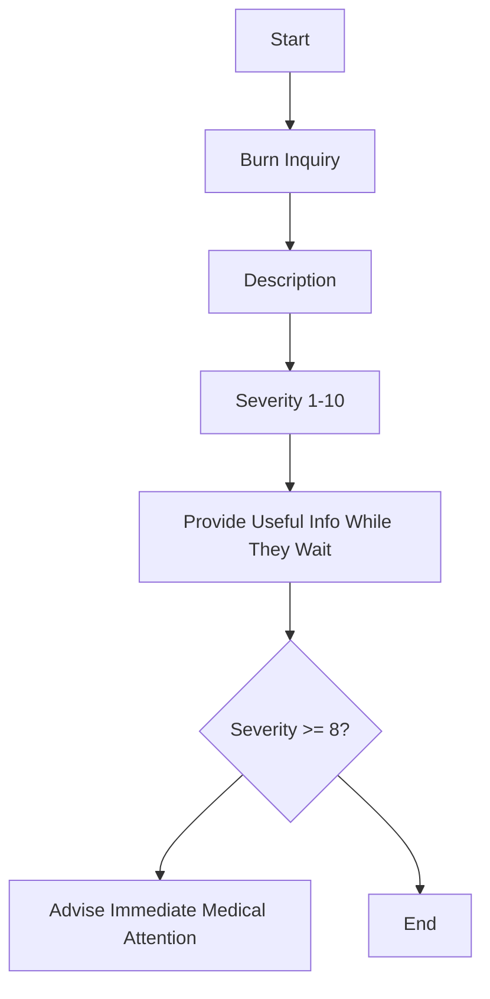
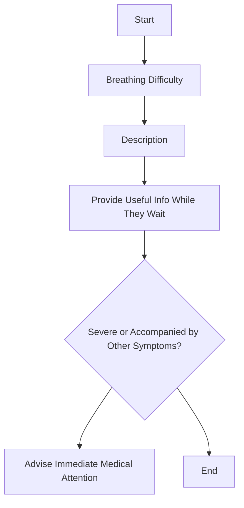
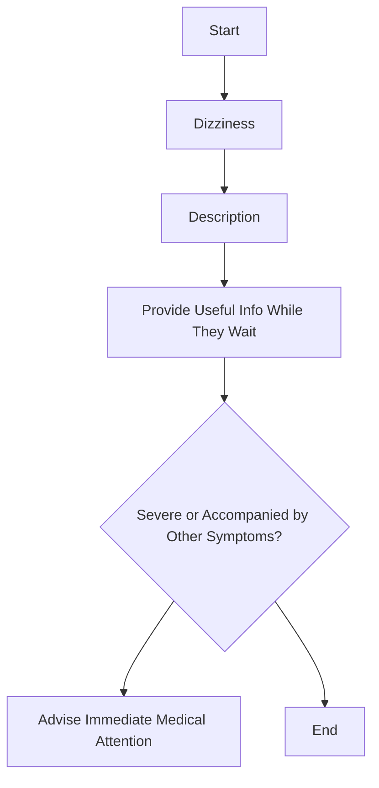
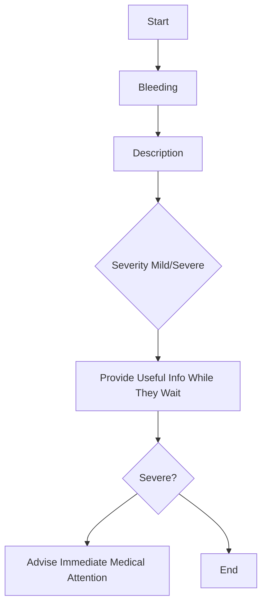
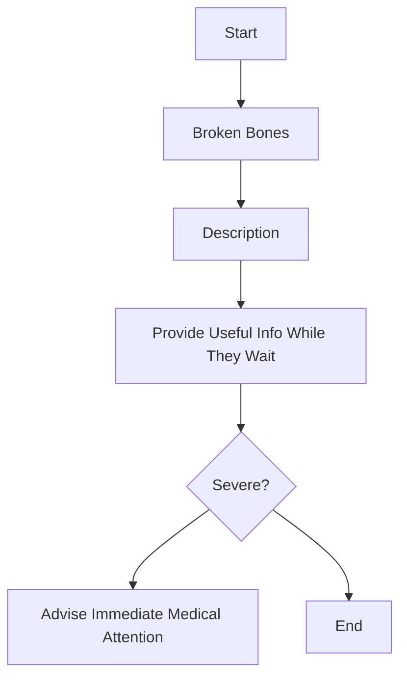

```mermaid
graph TD;
    A[Start] --> B[Burn Inquiry];
    B --> C[Description];
    C --> D[Severity 1-10];
    D --> E[Provide Useful Info While They Wait];
    E --> F{Severity >= 8?};
    F --> G[Advise Immediate Medical Attention];
    F --> H[End];
```

```mermaid
graph TD;
    A[Start] --> B[Chest Pain];
    B --> C[Description];
    C --> D[Provide Useful Info While They Wait];
    D --> E{Severe or Accompanied by Other Symptoms?};
    E --> F[Advise Immediate Medical Attention];
    E --> G[End];
```

```mermaid
graph TD;
    A[Start] --> B[Breathing Difficulty];
    B --> C[Description];
    C --> D[Provide Useful Info While They Wait];
    D --> E{Severe or Accompanied by Other Symptoms?};
    E --> F[Advise Immediate Medical Attention];
    E --> G[End];
```

```mermaid
graph TD;
    A[Start] --> B[Dizziness];
    B --> C[Description];
    C --> D[Provide Useful Info While They Wait];
    D --> E{Severe or Accompanied by Other Symptoms?};
    E --> F[Advise Immediate Medical Attention];
    E --> G[End];
```

```mermaid
graph TD;
    A[Start] --> B[Bleeding];
    B --> C[Description];
    C --> D{Severity Mild/Severe};
    D --> E[Provide Useful Info While They Wait];
    E --> F{Severe?};
    F --> G[Advise Immediate Medical Attention];
    F --> H[End];
```

```mermaid
graph TD;
    A[Start] --> B[Broken Bones];
    B --> C[Description];
    C --> D[Provide Useful Info While They Wait];
    D --> E{Severe?};
    E --> F[Advise Immediate Medical Attention];
    E --> G[End];
```
